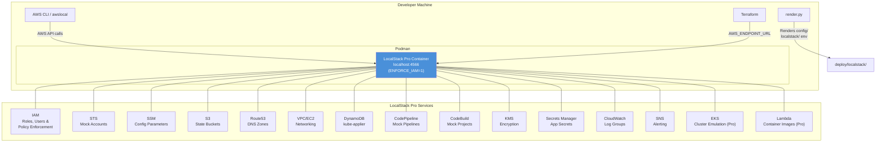

# LocalStack Pro Local Testing Environment

LocalStack Pro provides a local AWS cloud emulation that allows developers to
test the ROSA HyperFleet deployment pipeline without real AWS accounts or
clusters. This environment mirrors the multi-account AWS setup using mock
resources running in a container managed by Podman.

> **Note:** This environment requires a
> [LocalStack Pro](https://www.localstack.cloud/) subscription for full EKS
> emulation, Lambda container image support, and IAM policy enforcement.

## Overview

The LocalStack environment emulates:

- **Multi-account structure** -- Central, RC, MC, and Customer account IDs with
  IAM roles
- **SSM parameters** -- Config values expected by the rendering pipeline
- **Route53 hosted zones** -- DNS zones for the local domain
- **S3 buckets** -- Terraform state storage
- **VPC infrastructure** -- Basic networking with subnets and security groups
- **CodePipeline/CodeBuild** -- Mock CI/CD pipelines
- **DynamoDB** -- kube-applier tables
- **KMS, Secrets Manager, SNS, CloudWatch** -- Supporting services

## Prerequisites

- **LocalStack Pro auth token** -- sign up at
  [localstack.cloud](https://www.localstack.cloud/) and generate an API key at
  [Account -> API Keys](https://app.localstack.cloud/account/apikeys)
- **Podman** with `docker compose` support (podman provides Docker CLI
  compatibility natively; no separate `podman-compose` needed)
- **AWS CLI v2** (for the `localstack-shell` command)
- **awslocal** (optional, for direct LocalStack interaction):
  `pip install awscli-local`

### Podman Socket Setup

LocalStack needs access to the container engine socket for Lambda, ECS, and EKS
emulation. Activate the podman user socket before starting:

```bash
systemctl --user enable --now podman.socket
```

The `make localstack-up` target does this automatically. If you use a
non-default socket path, set `DOCKER_SOCK`:

```bash
export DOCKER_SOCK=/run/user/$(id -u)/podman/podman.sock
```

## Setting Up Your Auth Token

LocalStack Pro requires an authentication token. Set it in your shell before
running any `make localstack-*` command:

```bash
# Add to your ~/.bashrc, ~/.zshrc, or similar:
export LOCALSTACK_AUTH_TOKEN="ls-your-token-here"
```

The `localstack-env.sh` script checks for this variable and will refuse to
start if it is missing.

## Quick Start

```bash
# 0. Set your LocalStack Pro auth token (if not already in shell profile)
export LOCALSTACK_AUTH_TOKEN="ls-your-token-here"

# 1. Start LocalStack
make localstack-up

# 2. Bootstrap the mock AWS environment
make localstack-provision

# 3. Check service status
make localstack-status

# 4. Open an interactive shell
make localstack-shell

# 5. Tear down when done
make localstack-teardown
```

## Architecture



## Account Mapping

The LocalStack environment uses mock 12-digit account IDs that mirror the real
multi-account structure:

| Account  | Real Purpose                                        | LocalStack ID  |
| -------- | --------------------------------------------------- | -------------- |
| Central  | Pipeline infrastructure, SSM, terraform state       | `000000000001` |
| RC       | Regional cluster (EKS, RDS, API Gateway)            | `000000000002` |
| MC       | Management clusters hosting customer control planes | `000000000003` |
| Customer | Customer AWS account for hosted cluster workloads   | `000000000004` |

## Makefile Targets

| Target                             | Description                                                                    |
| ---------------------------------- | ------------------------------------------------------------------------------ |
| `make localstack-up`               | Start LocalStack services                                                      |
| `make localstack-provision`        | Bootstrap the local AWS environment                                            |
| `make localstack-teardown`         | Stop and clean up LocalStack                                                   |
| `make localstack-shell`            | Interactive shell against LocalStack                                           |
| `make localstack-status`           | Show LocalStack service status                                                 |
| `make localstack-reset`            | Full reset (destroy + recreate)                                                |
| `make localstack-assume-role`      | Assume an IAM role in a specific account (`ACCOUNT=central\|rc\|mc\|customer`) |
| `make localstack-eks-kubeconfig`   | Update kubeconfig for a LocalStack EKS cluster (`CLUSTER=<name>`)              |
| `make localstack-trigger-pipeline` | Trigger a CodeBuild/CodePipeline execution (`PIPELINE=<name>`)                 |

## Rendering Configs

The `config/localstack/` directory integrates with the standard rendering
pipeline:

```bash
# Render all environments (including localstack)
uv run scripts/render.py

# Output appears in deploy/localstack/us-east-1/
```

The rendered files use hardcoded mock account IDs instead of `ssm:///`
references, so they work without needing SSM parameter resolution at pipeline
time.

## Using with Terraform

To point Terraform at LocalStack, set the endpoint in your provider
configuration or via environment variables:

```bash
# In the localstack shell (make localstack-shell), the endpoint is
# pre-configured. For manual usage:
export AWS_ENDPOINT_URL=http://localhost:4566
export AWS_ACCESS_KEY_ID=test
export AWS_SECRET_ACCESS_KEY=test
export AWS_DEFAULT_REGION=us-east-1

terraform init
terraform plan
terraform apply
```

## IAM Enforcement

This environment runs with `ENFORCE_IAM=1`, a LocalStack Pro feature that
enforces IAM policies on every API call -- just like real AWS. This means:

- **Credentials matter.** The default `test`/`test` credentials used by
  `awslocal` are mapped to an internal admin account. For scoped testing, use
  the IAM users created by `init-aws.sh`.
- **Policies are checked.** If a user or role lacks the required IAM
  permission, the API call returns `AccessDeniedException` -- exactly as AWS
  would.
- **Role assumption works.** `sts:AssumeRole` returns scoped temporary
  credentials whose effective permissions are the intersection of the role
  policy and the caller's permissions.

### Pre-created IAM Users

The `init-aws.sh` bootstrap creates IAM users with access keys for testing
under enforcement. Credentials are stored in SSM at
`/localstack/iam/<user>/access-key-id` and
`/localstack/iam/<user>/secret-access-key`.

| User                       | Policy              | Purpose                           |
| -------------------------- | ------------------- | --------------------------------- |
| `localstack-central-admin` | AdministratorAccess | Central account pipeline admin    |
| `localstack-rc-operator`   | AdministratorAccess | Regional cluster infrastructure   |
| `localstack-mc-operator`   | AdministratorAccess | Management cluster infrastructure |
| `localstack-readonly`      | Custom read-only    | Least-privilege access testing    |

To use a specific IAM user in the shell:

```bash
# Retrieve credentials from SSM
ACCESS_KEY=$(awslocal ssm get-parameter \
    --name /localstack/iam/localstack-readonly/access-key-id \
    --with-decryption --query Parameter.Value --output text)
SECRET_KEY=$(awslocal ssm get-parameter \
    --name /localstack/iam/localstack-readonly/secret-access-key \
    --with-decryption --query Parameter.Value --output text)

# Use them
AWS_ACCESS_KEY_ID=$ACCESS_KEY \
AWS_SECRET_ACCESS_KEY=$SECRET_KEY \
AWS_ENDPOINT_URL=http://localhost:4566 \
    aws s3 ls  # succeeds -- read-only policy allows s3:ListBucket

AWS_ACCESS_KEY_ID=$ACCESS_KEY \
AWS_SECRET_ACCESS_KEY=$SECRET_KEY \
AWS_ENDPOINT_URL=http://localhost:4566 \
    aws s3 mb s3://new-bucket  # fails -- AccessDeniedException
```

### Disabling IAM Enforcement

If IAM enforcement interferes with a specific test, you can disable it
temporarily by setting `ENFORCE_IAM=0` in the `docker-compose.localstack.yaml`
environment section and restarting LocalStack.

## Assuming IAM Roles

The `localstack-assume-role` target lets you assume the
`OrganizationAccountAccessRole` for any of the four emulated accounts and drops
you into a subshell with the temporary credentials pre-configured:

```bash
# Assume the RC account role
make localstack-assume-role ACCOUNT=rc

# Assume the MC account role
make localstack-assume-role ACCOUNT=mc

# Assume the customer account role
make localstack-assume-role ACCOUNT=customer

# Assume the central account role
make localstack-assume-role ACCOUNT=central
```

Inside the subshell, the `AWS_ACCESS_KEY_ID`, `AWS_SECRET_ACCESS_KEY`, and
`AWS_SESSION_TOKEN` environment variables are set to the temporary credentials
returned by `sts:AssumeRole`. The prompt changes to indicate which account you
are in (e.g. `(localstack:rc)`).

Type `exit` to leave the subshell and return to your normal credentials.

### Account Name to ID Mapping

| Name       | Account ID     |
| ---------- | -------------- |
| `central`  | `000000000001` |
| `rc`       | `000000000002` |
| `mc`       | `000000000003` |
| `customer` | `000000000004` |

## EKS Clusters (k3s Emulation)

LocalStack Pro emulates EKS using k3s containers. The bootstrap script
(`init-aws.sh`) creates two EKS clusters automatically:

| Cluster      | Purpose                              | VPC            |
| ------------ | ------------------------------------ | -------------- |
| `rc-cluster` | Regional cluster (mirrors real RC)   | Regional VPC   |
| `mc-cluster` | Management cluster (mirrors real MC) | Management VPC |

### Retrieving Kubeconfig

```bash
# Get kubeconfig for the RC cluster (default)
make localstack-eks-kubeconfig

# Get kubeconfig for the MC cluster
make localstack-eks-kubeconfig CLUSTER=mc-cluster

# Then use kubectl normally
kubectl get nodes
kubectl get namespaces
```

The `localstack-eks-kubeconfig` target calls `awslocal eks update-kubeconfig`,
which writes a context entry to your `~/.kube/config`. The k3s cluster runs
inside the LocalStack container and is accessible via the kubeconfig endpoint.

### Limitations

The k3s-based EKS emulation is suitable for testing `kubectl` workflows,
Helm chart installations, and kubeconfig generation. It is **not** a full EKS
control plane -- features like managed node groups, Fargate profiles, and IRSA
(IAM Roles for Service Accounts) are not fully supported.

## Triggering Pipelines

The `localstack-trigger-pipeline` target lets you trigger CodeBuild projects
or CodePipeline executions against the emulated CI/CD infrastructure:

### CodeBuild

```bash
# Trigger a CodeBuild project using the current repo as source
make localstack-trigger-pipeline PIPELINE=localstack-pipeline-provisioner

# Trigger with a specific repo and commit
make localstack-trigger-pipeline PIPELINE=localstack-pipeline-regional \
    REPO=https://github.com/openshift-online/rosa-hyperfleet.git \
    COMMIT=abc123

# The tool will:
#  1. Package the source directory into a zip archive
#  2. Upload it to S3 (terraform-state-000000000001/codebuild-source/<name>/source.zip)
#  3. Start the CodeBuild project with the S3 source override
#  4. Print the build ID and commands to check status / tail logs
```

### CodePipeline

```bash
# Trigger a CodePipeline execution
make localstack-trigger-pipeline PIPELINE=localstack-pipeline-provisioner

# The tool auto-detects whether the name is a CodeBuild project or CodePipeline.
# If both exist with the same name, CodeBuild takes priority.
```

### Available Pipelines

These pipelines are created by `init-aws.sh`:

| Name                              | Type      | Purpose                      |
| --------------------------------- | --------- | ---------------------------- |
| `localstack-pipeline-provisioner` | Both      | Central provisioner pipeline |
| `localstack-pipeline-regional`    | Both      | Regional cluster pipeline    |
| `localstack-pipeline-mc01`        | CodeBuild | Management cluster pipeline  |

## Known Limitations

1. **EKS is emulated via k3s** -- LocalStack Pro runs k3s containers to
   emulate EKS clusters. Basic `kubectl` operations work (get nodes, deploy
   pods, install Helm charts), but advanced EKS features (managed node groups,
   Fargate profiles, IRSA) are not fully supported.

2. **No real RDS** -- Aurora/RDS APIs return mock responses. Database
   connectivity testing requires a separate PostgreSQL container.

3. **ElastiCache is limited** -- LocalStack provides basic ElastiCache API
   stubs but does not run a real Valkey/Redis instance.

4. **CodePipeline/CodeBuild are stubs** -- Pipeline executions are mocked and
   do not actually run build steps. Use this to test pipeline creation and
   configuration, not build execution.

5. **Cross-account STS is simplified** -- `sts:AssumeRole` returns scoped
   credentials but all resources exist in a single LocalStack namespace.
   Account-level resource isolation is not fully enforced.

6. **Persistence** -- LocalStack state is persisted to `.localstack/` by
   default. Use `make localstack-reset` for a clean slate.

7. **Network isolation** -- Unlike real AWS, there is no network isolation
   between VPCs or accounts. All resources share the same LocalStack endpoint.

8. **Pro token required** -- The `localstack/localstack-pro` image requires a
   valid `LOCALSTACK_AUTH_TOKEN`. Without it, the container will not start.

## Troubleshooting

### "LOCALSTACK_AUTH_TOKEN is not set"

```bash
# Set the token in your current shell
export LOCALSTACK_AUTH_TOKEN="ls-your-token-here"

# Or add to your shell profile for persistence
echo 'export LOCALSTACK_AUTH_TOKEN="ls-your-token-here"' >> ~/.bashrc
```

Get your token at
[app.localstack.cloud/account/apikeys](https://app.localstack.cloud/account/apikeys).

### LocalStack fails to start

```bash
# Check container logs (auth token issues appear here)
docker logs rosa-hyperfleet-localstack

# Verify Podman is running and the socket is active
systemctl --user status podman.socket

# Check for port conflicts on 4566
lsof -i :4566
```

### Podman socket issues

If LocalStack cannot reach the container engine socket:

```bash
# Activate the podman socket
systemctl --user enable --now podman.socket

# Verify the socket exists
ls -la /run/user/$(id -u)/podman/podman.sock

# If using a custom socket path, set DOCKER_SOCK before starting:
export DOCKER_SOCK=/path/to/your/podman.sock
make localstack-up
```

### AccessDeniedException from IAM enforcement

With `ENFORCE_IAM=1`, API calls without sufficient IAM permissions are
rejected. If you hit `AccessDeniedException`:

```bash
# Use awslocal (uses internal admin credentials, bypasses IAM)
awslocal s3 ls

# Or use one of the pre-created admin users
# (see "IAM Enforcement" section above for credential retrieval)
```

### Init script fails

```bash
# Re-run the init script manually
docker exec rosa-hyperfleet-localstack \
    /etc/localstack/init/ready.d/init-aws.sh

# Or run provision again
make localstack-provision
```

### AWS CLI cannot connect

```bash
# Verify LocalStack is healthy
curl http://localhost:4566/_localstack/health

# Ensure environment variables are set
export AWS_ENDPOINT_URL=http://localhost:4566
export AWS_ACCESS_KEY_ID=test
export AWS_SECRET_ACCESS_KEY=test
```

### Services show as "unavailable"

```bash
# Some services start lazily on first API call.
# Trigger initialization:
awslocal s3 ls
awslocal ssm get-parameters-by-path --path /infra/
```

### Clean restart

```bash
# Full reset removes all state and volumes
make localstack-reset
```
