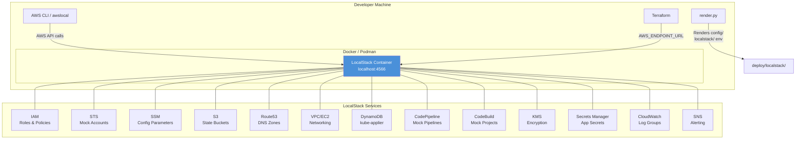

# LocalStack Local Testing Environment

LocalStack provides a local AWS cloud emulation that allows developers to test
the ROSA HyperFleet deployment pipeline without real AWS accounts or clusters.
This environment mirrors the multi-account AWS setup using mock resources
running in a Docker container.

## Overview

The LocalStack environment emulates:

- **Multi-account structure** — Central, RC, MC, and Customer account IDs with
  IAM roles
- **SSM parameters** — Config values expected by the rendering pipeline
- **Route53 hosted zones** — DNS zones for the local domain
- **S3 buckets** — Terraform state storage
- **VPC infrastructure** — Basic networking with subnets and security groups
- **CodePipeline/CodeBuild** — Mock CI/CD pipelines
- **DynamoDB** — kube-applier tables
- **KMS, Secrets Manager, SNS, CloudWatch** — Supporting services

## Prerequisites

- **Docker** or **Podman** with compose support (`docker compose`,
  `docker-compose`, or `podman-compose`)
- **AWS CLI v2** (for the `localstack-shell` command)
- **awslocal** (optional, for direct LocalStack interaction):
  `pip install awscli-local`

## Quick Start

```bash
# 1. Start LocalStack
make localstack-up

# 2. Bootstrap the mock AWS environment
make localstack-provision

# 3. Check service status
make localstack-status

# 4. Open an interactive shell
make localstack-shell

# 5. Tear down when done
make localstack-teardown
```

## Architecture



## Account Mapping

The LocalStack environment uses mock 12-digit account IDs that mirror the real
multi-account structure:

| Account  | Real Purpose                                        | LocalStack ID  |
| -------- | --------------------------------------------------- | -------------- |
| Central  | Pipeline infrastructure, SSM, terraform state       | `000000000001` |
| RC       | Regional cluster (EKS, RDS, API Gateway)            | `000000000002` |
| MC       | Management clusters hosting customer control planes | `000000000003` |
| Customer | Customer AWS account for hosted cluster workloads   | `000000000004` |

## Makefile Targets

| Target                      | Description                          |
| --------------------------- | ------------------------------------ |
| `make localstack-up`        | Start LocalStack services            |
| `make localstack-provision` | Bootstrap the local AWS environment  |
| `make localstack-teardown`  | Stop and clean up LocalStack         |
| `make localstack-shell`     | Interactive shell against LocalStack |
| `make localstack-status`    | Show LocalStack service status       |
| `make localstack-reset`     | Full reset (destroy + recreate)      |

## Rendering Configs

The `config/localstack/` directory integrates with the standard rendering
pipeline:

```bash
# Render all environments (including localstack)
uv run scripts/render.py

# Output appears in deploy/localstack/us-east-1/
```

The rendered files use hardcoded mock account IDs instead of `ssm:///`
references, so they work without needing SSM parameter resolution at pipeline
time.

## Using with Terraform

To point Terraform at LocalStack, set the endpoint in your provider
configuration or via environment variables:

```bash
# In the localstack shell (make localstack-shell), the endpoint is
# pre-configured. For manual usage:
export AWS_ENDPOINT_URL=http://localhost:4566
export AWS_ACCESS_KEY_ID=test
export AWS_SECRET_ACCESS_KEY=test
export AWS_DEFAULT_REGION=us-east-1

terraform init
terraform plan
terraform apply
```

## Known Limitations

1. **No real EKS clusters** — LocalStack's free tier provides mock EKS API
   responses but does not run actual Kubernetes clusters. Use this environment
   for testing Terraform plans, config rendering, and pipeline structure — not
   for end-to-end cluster operations.

2. **No real RDS** — Aurora/RDS APIs return mock responses. Database
   connectivity testing requires a separate PostgreSQL container.

3. **IAM is not enforced** — LocalStack accepts any credentials and does not
   enforce IAM policies. Use this for structural testing, not security
   validation.

4. **ElastiCache is limited** — The free LocalStack image provides basic
   ElastiCache API stubs but does not run a real Valkey/Redis instance.

5. **CodePipeline/CodeBuild are stubs** — Pipeline executions are mocked and
   do not actually run build steps. Use this to test pipeline creation and
   configuration, not build execution.

6. **No cross-account STS** — `sts:AssumeRole` calls succeed but do not
   actually switch account context. All resources exist in a single namespace.

7. **Persistence** — LocalStack state is persisted to `.localstack/` by
   default. Use `make localstack-reset` for a clean slate.

8. **Network isolation** — Unlike real AWS, there is no network isolation
   between VPCs or accounts. All resources share the same LocalStack endpoint.

## Troubleshooting

### LocalStack fails to start

```bash
# Check container logs
docker logs rosa-hyperfleet-localstack

# Verify Docker/Podman is running
docker info

# Check for port conflicts on 4566
lsof -i :4566
```

### Init script fails

```bash
# Re-run the init script manually
docker exec rosa-hyperfleet-localstack \
    /etc/localstack/init/ready.d/init-aws.sh

# Or run provision again
make localstack-provision
```

### AWS CLI cannot connect

```bash
# Verify LocalStack is healthy
curl http://localhost:4566/_localstack/health

# Ensure environment variables are set
export AWS_ENDPOINT_URL=http://localhost:4566
export AWS_ACCESS_KEY_ID=test
export AWS_SECRET_ACCESS_KEY=test
```

### Services show as "unavailable"

```bash
# Some services start lazily on first API call.
# Trigger initialization:
awslocal s3 ls
awslocal ssm get-parameters-by-path --path /infra/
```

### Clean restart

```bash
# Full reset removes all state and volumes
make localstack-reset
```
